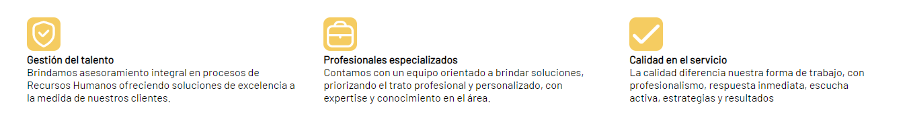
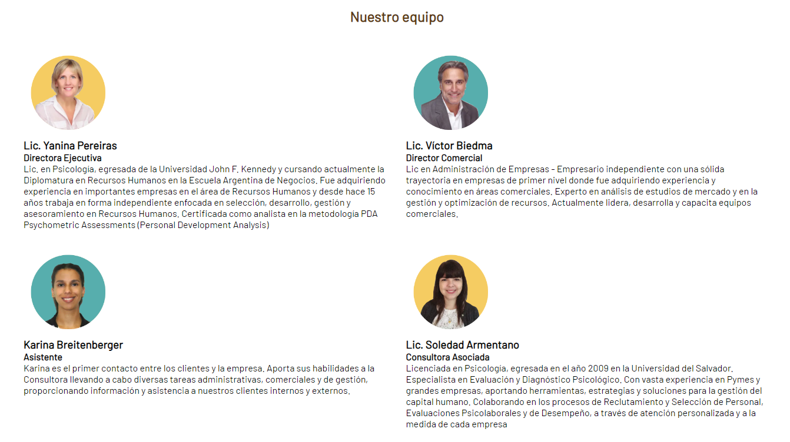
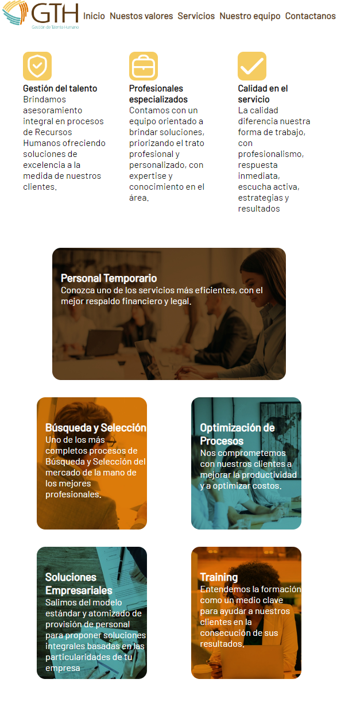
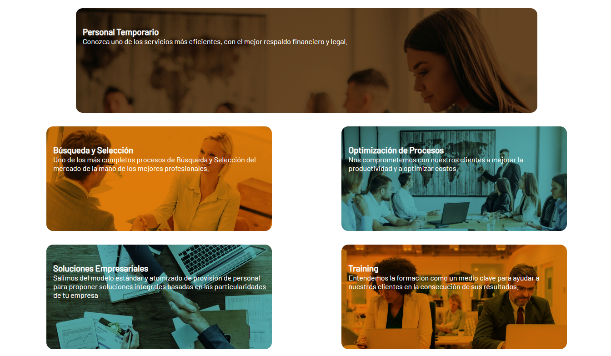

# Consultora GTH
## Diseño de web visual

## Introducción

A lo largo de este documento haremos un análisis de las decisiones visuales tomadas para el diseño de una posible web para la consultora GTH.

## Página Web
#### Presentación
Al entrar encontramos el nombre de la empresa con su lema, mostrando las marcas que confían en nosotros para dar credibilidad al usuario. 

#### Servicios
Continuamos con el mismo formato, presentando nuestra visión y valores. Además presentamos los servicios que brinda la empresa para el usuario. 

#### Equipo
Seguimos con la presentación del equipo que trabaja en la consultora, las figuras más importantes con las que el usuario debe familiarizarse.

Concluímos con un footer donde pueden contactarse con la empresa, todo dentro de una sola página de inicio.

## Decisiones Técnicas

Decidí colocar todo dentro de una sola página para que así sea más sencillo para el usuario. Al no tener que navegar por distintas pestañas, puede conseguir lo que quiere sin perderse. Además, el diseño responsive de la misma permite visualizarla desde distintos dispositivos, haciendo una experiencia agradable en todas las posibles formas de ingresar. 
En el header tenemos una barra de navegación con la propiedad Sticky para que el usuario pueda navegar fácilmente a través de toda la página web. La misma cuenta con el logo de la empresa y los links necesarios para desplazarse por la web.

## Decisiones visuales

La paleta de colores surge del mismo logo de la empresa, por lo que las utilicé para darle vida a la web. Utilivé texto encima de imágenes con los colores de la empresa así se logra que la página no sea plana. En los valores tomé varios iconos en representación de ellos para lograr una distinción más clara.

En la oferta de servicios más concreta, los diferenciamos con distintas imágenes que representan a ellos. Tenemos dos con el color naranja, dos con el color azul y solo una marrón, pero esta última más grande que las anteriores. Decidí usar la marrón en ese lugar ya que es el color más neutro de los tres, entonces la figura se siente equilibrada. Además, al ser el naranja y azul complementarios, intercalarlos de esa forma llama más la atención que si se hubiera hecho con el marrón.

Por último, tenemos el footer con un color naranja para romper con tanto fondo blanco y diferenciarlo bien. En este caso tenemos el logo en negativo para que se entienda bien, y el teléfono y redes sociales en negro, para que se entienda que es allí donde debemos dirigir la mirada. Se diferencia del logo, con el cual no se puede interactuar.

## Conclusión

Tenemos una web clara, sencilla y bien equilibrada en cuanto a diseño, por lo que el usario logra comprender bien y fácil la tarea de la consultora, siendo a su vez agradable de ver. Por lo tanto, quien quiera contratar a la empresa tiene una experiencia completa que le permite conseguir su objetivo de forma placentera y óptima.